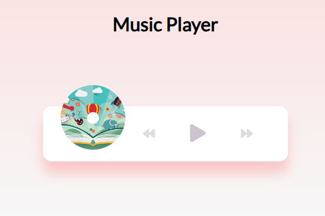

# 🎵 Music Player Web App

This is a simple and elegant **music player** built with **HTML**, **CSS**, and **JavaScript**.  
Users can play, pause, skip, go back, and seek through songs — all with a clean and responsive UI.

---

## 🎧 Features

- ✅ Play / Pause current song
- ⏮️ Previous and ⏭️ Next song navigation
- 📈 Animated progress bar that updates in real time
- ⏩ Click on the progress bar to seek
- 🖼️ Dynamic song info and cover image loading

---

## 🧱 Tech Stack

- HTML5
- CSS3 (custom styling)
- Vanilla JavaScript (no frameworks)
- Font Awesome for icons

---

## 📸 Preview

